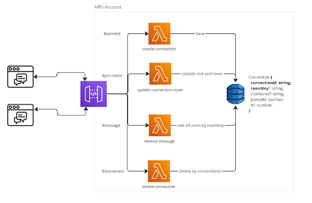

# Lambda com API Gateway WebSocket
Este repositório contém um exemplo de implementação de um backend utilizando AWS Lambda e API Gateway WebSocket para gerenciar a comunicação em tempo real de um chat, além de um frontend simples que se conecta ao backend.

Estrutura do Repositório
backend/: Contém o código do backend, implementado com AWS Lambda e API Gateway WebSocket, responsável pelo gerenciamento das conexões e mensagens do chat.

front/: Diretório com o código do frontend de um chat exemplo, que faz a conexão com o backend via WebSocket, possibilitando a comunicação em tempo real entre usuários.

## Arquitetura do projeto
O backend tem a seguinte arquitetura e composição:

**Apresentação:** Na raiz do projeto, você encontrará um arquivo PDF com a apresentação da talk associada a este projeto, que aborda a implementação e os principais conceitos utilizados.